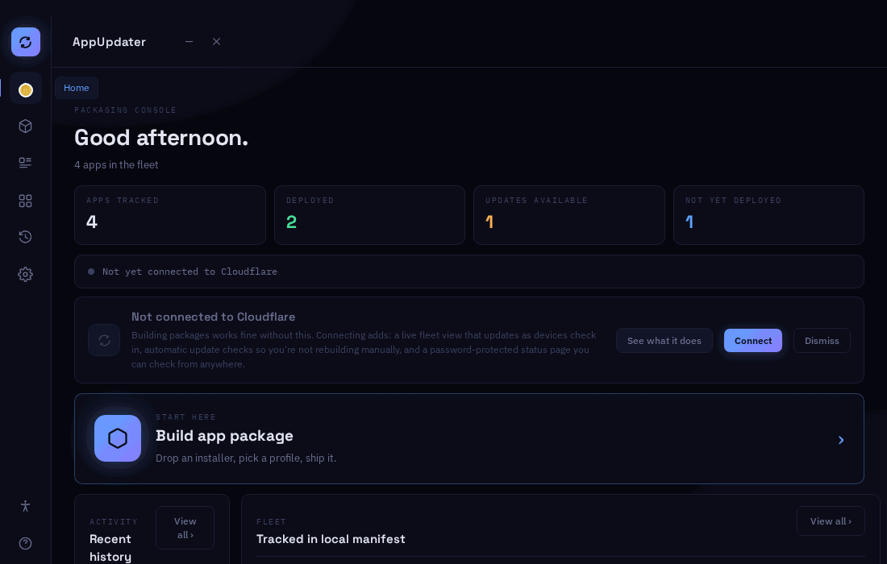
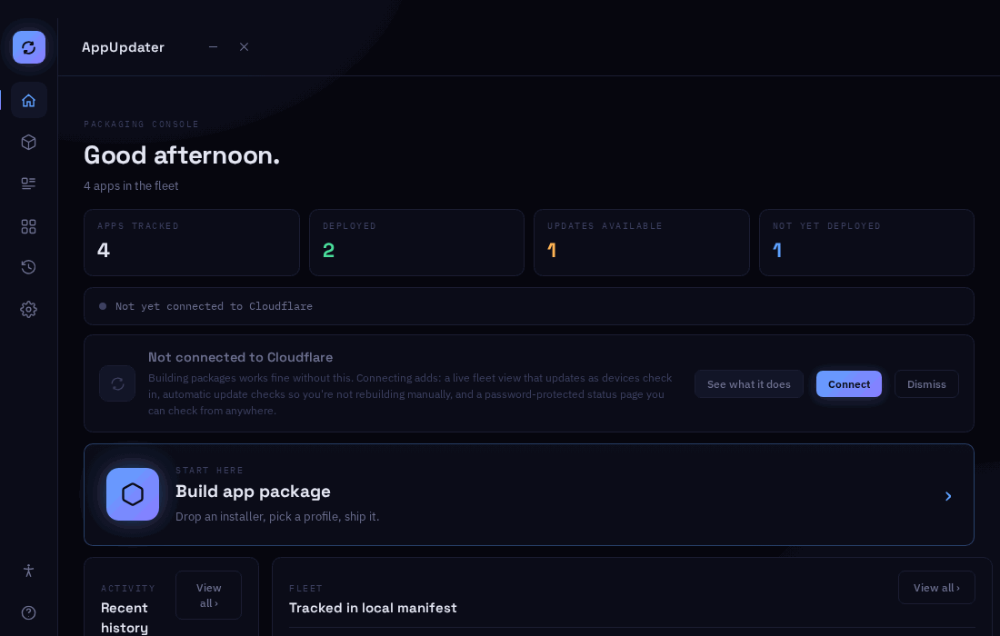
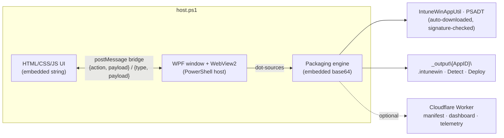
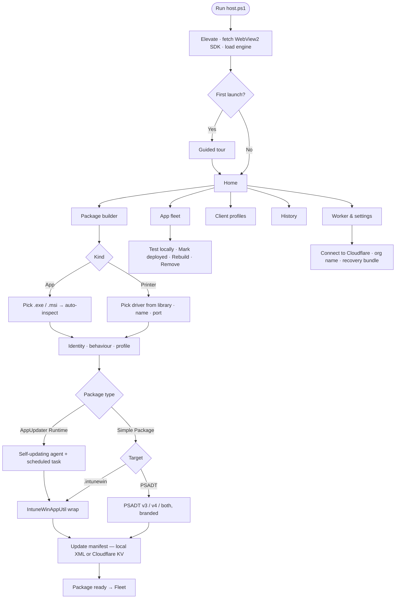

<div align="center">

# 📦 AppUpdater

**Zero-infrastructure Intune Win32 packaging for Windows IT admins**

Builds deployment-ready packages from any `.exe` or `.msi` installer — and optionally connects to a Cloudflare Worker it deploys itself, giving you a live web dashboard, per-device telemetry, and TOTP-protected authentication.

<br/>


[](https://github.com/Lyvvy-xyz/Appupdater/actions/workflows/click-test.yml)
[](LICENSE)

<br/>

**[⬇ Download AppUpdater.ps1](https://github.com/Lyvvy-xyz/Appupdater/releases/latest/download/AppUpdater.ps1)** — one file; it fetches every dependency on first run.

<br/>

[Overview](#-overview) · [See it in action](#-see-it-in-action) · [Why AppUpdater](#-why-appupdater) · [How it works](#️-how-it-works) · [Quick Start](#-quick-start) · [The Interface](#️-the-interface) · [Building a Package](#-building-a-package) · [Cloudflare Mode](#️-cloudflare-mode) · [Security](#-security) · [Reference](#-reference)

</div>

---

## 🔍 Overview

AppUpdater runs on an IT admin's Windows machine and turns any installer into a complete Intune Win32 deployment in minutes. It auto-downloads every tool it needs — including `IntuneWinAppUtil.exe` and `PSAppDeployToolkit` — so there is nothing to install beforehand.

Each build produces three output files ready for Intune:

- A **`.intunewin` package** for upload to the Intune portal
- A **detection script** that checks for the app using scheduled task + file existence
- A **deploy script** that provisions a self-updating agent on the target device — creating a scheduled task, log files with proper ACLs, and a desktop shortcut that any user can click without needing admin rights

> [!TIP]
> **Everything is self-contained.** AppUpdater downloads `IntuneWinAppUtil.exe` from Microsoft's official GitHub repository on first build, verifies the Authenticode signature, and reuses it from then on. PSAppDeployToolkit is cached the same way. You only need PowerShell 5.1 and admin rights.

### Feature Highlights

<table>
<tr>
<td>🖥️ <strong>Dark-theme WebView2 GUI</strong> with guided tour &amp; accessibility modes</td>
<td>☁️ <strong>Optional Cloudflare Worker</strong> backend — auto-deployed</td>
</tr>
<tr>
<td>📦 <strong>Auto-generates</strong> <code>.intunewin</code> + detect + deploy scripts</td>
<td>🔐 <strong>TOTP MFA</strong> for the web dashboard</td>
</tr>
<tr>
<td>🤖 <strong>Auto-downloads</strong> IntuneWinAppUtil &amp; PSAppDeployToolkit</td>
<td>🔑 <strong>Windows Credential Manager</strong> (DPAPI) token storage</td>
</tr>
<tr>
<td>🛡️ <strong>Authenticode verification</strong> of all downloaded binaries</td>
<td>📡 <strong>Per-app event telemetry</strong> with HMAC secrets</td>
</tr>
<tr>
<td>🔄 <strong>Full offline mode</strong> — no cloud required</td>
<td>🧙 <strong>Guided tour</strong> on first launch</td>
</tr>
<tr>
<td>📋 <strong>PSADT v3 &amp; v4 export</strong> for close-apps prompts</td>
<td>🔒 <strong>HMAC-signed sessions</strong>, rate-limited login</td>
</tr>
</table>

### Operating Modes

| | ☁️ Cloudflare-Connected | 💾 Offline |
|---|---|---|
| **Manifest hosting** | Cloudflare KV (`APP_MANIFEST` namespace) | Local `appVersions.xml` |
| **Authentication** | TOTP + PBKDF2-SHA256 session | N/A |
| **Device telemetry** | Per-device event log via Worker | None |
| **Web dashboard** | `https://{worker}.workers.dev/status` | None |
| **Token storage** | Windows Credential Manager (machine scope) | N/A |
| **Setup** | Cloudflare API token required (2 min wizard) | None |
| **Launch** | `.\host.ps1`, then **Worker & settings → Connect** | `.\host.ps1` (the default until you connect) |

---

## 🎬 See it in action

**Building a package** — pick an installer, AppUpdater reads its publisher, version, silent switches and blocking process, then generates the deploy script, detect script, manifest entry and `.intunewin` in one pass:



**Getting around** — Home dashboard, App fleet (built / deployed / update-available status per app), History, and Client profiles with a live PSADT branding preview:



> [!NOTE]
> These recordings are the real `host.ps1` interface rendered headlessly, with the PowerShell side replaced by a stub that returns sample data (Firefox, VLC, 7-Zip, Notepad++). Paths, timings and sizes shown are illustrative.

---

## 💡 Why AppUpdater

Getting one third-party app into Intune as a Win32 app normally means stitching several tools together by hand — and then doing it all again every time the vendor ships an update.

| Step | 🛠️ By hand (IntuneWinAppUtil + PSADT + scripts) | 📦 AppUpdater |
|---|---|---|
| **Find install switches** | Search vendor docs, trial-and-error `/S`, `/qn`, `/VERYSILENT` | Auto-detected from the installer (NSIS, Inno, InstallShield, MSI…) |
| **Get the tooling** | Download IntuneWinAppUtil and PSADT, keep them current | Downloaded on first use, Authenticode-verified, cached |
| **Detection rule** | Hand-write a registry / file / version check | `Detect-{AppID}.ps1` generated for you |
| **Close running apps** | Hand-edit PSADT `Deploy-Application.ps1` | Blocking process detected; PSADT v3/v4 wrapped with your branding |
| **Package** | Run IntuneWinAppUtil with the right folder/setup args | One click → `.intunewin` |
| **Updates** | Repeat everything for every new version | Runtime mode: devices self-update from the manifest — no repackaging |
| **Visibility** | Intune portal only, delayed reporting | Local fleet + history, optional live Cloudflare dashboard |
| **Per-client branding (MSPs)** | Copy and edit toolkit folders per client | Client profiles applied at build time |

**Compared with the other common alternatives:**

- **Winget / Intune Enterprise App Catalog** — great when the app is in the catalog. AppUpdater covers everything that isn't: in-house installers, vendor-portal downloads, pinned versions, printers.
- **Paid packaging tools (e.g. Patch My PC, Advanced Installer)** — broader catalogs, but licensed per seat or device. AppUpdater is a single PowerShell script with zero infrastructure; the optional Cloudflare backend runs in your own Cloudflare account.
- **PSADT on its own** — AppUpdater still uses PSADT under the hood for PSADT-mode packages; it just generates the wrapper, branding and detection so you don't hand-edit them.

---

## ⚙️ How it works

AppUpdater is one file, `host.ps1`, containing three layers:



1. **Startup** — `host.ps1` self-elevates, fetches the pinned WebView2 SDK from nuget.org into `wv2\` if missing (and installs the WebView2 Runtime if the machine lacks it), decodes the embedded engine to a temp file and dot-sources it so all packaging functions are in scope.
2. **UI** — a borderless WPF window hosts a WebView2 control; the UI is loaded with `NavigateToString`, so there are no loose HTML files to tamper with.
3. **Bridge** — every button posts `{ action, payload }` to PowerShell (`build-package`, `get-fleet`, `browse-installer`, …). The host runs the matching handler and replies with `{ type, payload }` messages (`build-progress`, `build-log`, `build-done`, `fleet-data`, …) that the page renders.
4. **Build** — the engine inspects the installer, writes the deploy and detect scripts, updates the manifest (local `appVersions.xml` or Cloudflare KV), and wraps the result as `.intunewin` or a PSADT package. Progress streams back live to the progress screen.
5. **On the device** — Intune runs the deploy script, which installs a scheduled task that checks the manifest and updates the app, so new versions roll out without rebuilding the package.

---

## 🚀 Quick Start

### Prerequisites

| | |
|---|---|
| **OS** | Windows 10 or Windows 11 |
| **PowerShell** | 5.1 or later *(already installed on all modern Windows)* |
| **Admin rights** | Required for ACL enforcement and Credential Manager access |
| **Cloudflare account** | Optional — cloud-connected mode only |

> [!NOTE]
> `IntuneWinAppUtil.exe` and `PSAppDeployToolkit` are **automatically downloaded and verified** on first use. You do not need to install or find them manually.

### Launch

```powershell
# Right-click → Run with PowerShell, or from a console:
.\host.ps1
```

`host.ps1` re-launches itself elevated (UAC prompt), downloads the WebView2 SDK into `wv2\` on first run, and opens the app. Everything else — IntuneWinAppUtil, PSADT, the packaging engine — is either embedded or fetched on demand.

### First Launch

On first run a **guided tour** walks through each screen (Escape / arrow keys / Enter to navigate). It can be replayed any time from **Docs & help → Replay tour**.

- You start in **offline mode** — packages build locally and the manifest is `appVersions.xml`.
- To go cloud-connected, open **Worker & settings → Connect**. This runs the 7-step Cloudflare setup (API token, Worker deploy, dashboard password, optional TOTP MFA).
- Set your **organisation name** (shown in end-user popups) under Worker & settings, or per-client in **Client profiles**.

> [!IMPORTANT]
> Settings are saved to `.appupdater-config` with SYSTEM + Administrators–only ACLs.

---

## 🗺️ Application Flow



The pipeline rail at the top of the builder tracks the same stages: **Source → Identity → Configure → Wrap → Deliver**.

---

## 🖥️ The Interface

A borderless window with a left sidebar. Every screen is part of the same page, so switching is instant.

| Screen | What it's for |
|---|---|
| 🏠 **Home** | Fleet stats (total / deployed / updates / pending), recent activity, getting-started checklist, shortcut to build |
| 📦 **Package builder** | Drop or browse an installer (or switch to **Printer**), review auto-detected identity, choose Runtime vs Simple and `.intunewin` vs PSADT, live v3/v4 branding preview, **Build** |
| 📋 **App fleet** | Every app in the manifest with version, target and status badge; filter, bulk-select, **Test locally**, **Mark deployed**, **Rebuild**, **Remove** |
| 🎨 **Client profiles** | Named branding sets (org name, logo, banner, default target) applied per build — handy for MSPs |
| 🕑 **History** | Timeline of every build, deploy and removal |
| ⚙️ **Worker & settings** | Connect / disconnect Cloudflare, open the status dashboard, Worker options, default org name, recovery bundle export/import, release check |
| ♿ **Accessibility** | Reduce motion, high contrast, colour-blind safe palette (Okabe-Ito + shape cues) |
| ❓ **Docs & help** | Replay the guided tour, reset onboarding |

Keyboard: <kbd>Tab</kbd> / <kbd>Shift</kbd>+<kbd>Tab</kbd> with a visible focus ring everywhere, <kbd>Esc</kbd> closes dialogs, arrow keys / <kbd>Enter</kbd> drive the tour.

---

## 📦 Building a Package

### Phase 1 — Pick Your Installer

- Click the drop zone in **Package builder** to browse for an `.exe` or `.msi`
- MSI and EXE formats are both supported; type is detected automatically

### Phase 2 — Auto-Detection

AppUpdater inspects the installer and pre-fills every field. All fields are editable before building.

| Field | How it's determined |
|---|---|
| **App ID** | Derived from filename — alphanumeric + `. _ -`, max 64 chars, must start with letter or digit |
| **Display Name** | Read from file description metadata |
| **Silent Args** | Detected from installer type — MSI always gets `/qn /norestart` |
| **Registry Display Name** | Queried from the Windows uninstall registry |
| **Processes to Kill** | Executable names found alongside the installer |

### Phase 3 — App Form

<details>
<summary><strong>Full list of form fields — click to expand</strong></summary>

**Core Identity**

| Field | Required | Notes |
|---|---|---|
| App ID | ✅ | Alphanumeric + `. _ -`, ≤ 64 chars. Locked once the app exists in the manifest |
| Display Name | ✅ | Shown in the desktop shortcut and update popups |

**Download**

| Field | Required | Notes |
|---|---|---|
| Primary Download URL | ✅ | HTTPS only. The download is Authenticode-verified before install |
| Fallback URL | ❌ | HTTPS only. Used if primary fails |

**Installation**

| Field | Required | Notes |
|---|---|---|
| Silent Install Arguments | ✅ | e.g. `/quiet /norestart`. Auto-detected for MSIs |
| Registry Display Name | ✅ | Must exactly match the entry in **Add or Remove Programs** — used in the detection script |

**Advanced** *(auto-detected, optional to change)*

| Field | Notes |
|---|---|
| Processes to Kill | Comma-separated exe names (no `.exe`). Closed before install runs |
| Launch exe after install | Path to exe to open when install completes |
| Expected Publisher | Authenticode signer CN — verified on every device download |
| SHA-256 Hash | 64 hex chars. Enables hash check before install. Offline packages only |

**Package Type**

| Type | Behaviour |
|---|---|
| **Runtime** *(default)* | Installs a self-updating agent: scheduled task, logs, desktop shortcut. App keeps itself current |
| **Simple** | Bundles the installer directly — one-shot install, no runtime components left on the device |

</details>

### Phase 4 — Output Delivery

Choose how to deliver the package after building:

| Option | What happens |
|---|---|
| 📦 **Create `.intunewin`** | Downloads `IntuneWinAppUtil.exe` from Microsoft's GitHub (first use only), verifies Authenticode signature, packages everything into a `.intunewin` ready for Intune upload |
| ▶️ **Run on this machine** | Executes the generated `Deploy-{AppID}.ps1` immediately on the admin machine as administrator |
| 💾 **Save scripts only** | Writes `Detect-{AppID}.ps1` and `Deploy-{AppID}.ps1` to `C:\ProgramData\AppUpdater\_output\{AppID}\` |
| 🧰 **Export as PSADT** | Downloads and caches `PSAppDeployToolkit` from GitHub releases (first use only), wraps the deployment with v3 or v4 for close-apps prompts and enterprise UI |

> [!NOTE]
> `IntuneWinAppUtil.exe` is downloaded from `https://github.com/microsoft/Microsoft-Win32-Content-Prep-Tool` on first use, verified against Microsoft's Authenticode certificate, then reused from the script directory. **No manual download required.**

### Phase 5 — Manifest Update

After every build, AppUpdater automatically:

- Merges the app entry into `appVersions.xml`
- If Cloudflare-connected: pushes the updated manifest to the Worker via `POST /manifest` (bearer-authenticated)
- Stores a standalone `XMLEntry-{AppID}.xml` in the output folder

---

## 📋 Generated Artifacts

### Build Machine Output

All files land in `C:\ProgramData\AppUpdater\_output\{AppID}\`:

| File | Description |
|---|---|
| `{AppID}.intunewin` | Intune Win32 package — upload directly to the Intune portal |
| `Detect-{AppID}.ps1` | Detection script — exits `0` if deployed, `1` if not |
| `Deploy-{AppID}.ps1` | Deployment script — runs as SYSTEM via Intune |
| `XMLEntry-{AppID}.xml` | Standalone manifest entry for this single app |

### Detection Logic

```powershell
# Detect-{AppID}.ps1 — generated by AppUpdater
$taskExists   = Get-ScheduledTask -TaskName 'AppUpdater-{AppID}' -ErrorAction SilentlyContinue
$scriptExists = Test-Path 'C:\ProgramData\AppUpdater\{AppID}\{AppID}.ps1'

if ($taskExists -and $scriptExists) { Write-Host 'Detected'; exit 0 } else { exit 1 }
```

Both the **scheduled task** and the **script file** must exist for detection to pass.

### Deploy Script — What it Does on the Device

<details>
<summary><strong>All 8 deploy phases — click to expand</strong></summary>

The generated `Deploy-{AppID}.ps1` runs as **SYSTEM** via Intune and performs these phases in order:

**Phase 1 — Enable audit logging**

Enables PowerShell Script Block Logging (`HKLM:\SOFTWARE\Policies\Microsoft\Windows\PowerShell\ScriptBlockLogging`) so every PowerShell line executed on the device is written to the Windows Event Log (Event ID 4104) for forensic audit.

**Phase 2 — Create folder structure with ACLs**

Creates `C:\ProgramData\AppUpdater\{AppID}\` and `logs\` with strict NTFS permissions enforced via `takeown` and `icacls`:

| Principal | Rights |
|---|---|
| `NT AUTHORITY\SYSTEM` | Full control (OI CI F) |
| `BUILTIN\Administrators` | Full control (OI CI F) |
| `BUILTIN\Users` | Read & Execute (OI CI RX) |

**Phase 3 — Write the update script**

Decodes and writes the base64-embedded `{AppID}.ps1` (the combined auto-update + UI script) to `C:\ProgramData\AppUpdater\{AppID}\`.

**Phase 4 — Create log files with restricted ACLs**

| File | Access |
|---|---|
| `update-detail.log` | SYSTEM + Administrators only — full verbose transcript |
| `update-status.log` | User-readable — sanitised status lines |
| `update-task-run.log` | User-readable — run timestamps and outcomes |

**Phase 5 — Create staging folder**

Creates `C:\ProgramData\AppUpdater\{AppID}\staging\` accessible only by SYSTEM and Administrators. Downloaded installers land here temporarily and are cleared after each run.

**Phase 6 — Register the scheduled task**

| Setting | Value |
|---|---|
| Task name | `AppUpdater-{AppID}` |
| Runs as | `NT AUTHORITY\SYSTEM` |
| Run level | Highest |
| Execution policy | `RemoteSigned` |
| Timeout | 2 hours |
| Battery behaviour | AllowStartIfOnBatteries |

**Phase 7 — Grant users task-trigger rights**

Applies a COM DACL to the scheduled task so standard users can trigger it without UAC elevation. Uses a 15-second retry loop in case Task Scheduler is momentarily busy.

**Phase 8 — Create desktop shortcut**

Creates `C:\Users\Public\Desktop\Update {DisplayName}.lnk`. Falls back to the current user's desktop if Public Desktop is inaccessible.

| Property | Value |
|---|---|
| Target | `powershell.exe -NoProfile -ExecutionPolicy RemoteSigned -File "{AppDir}\{AppID}.ps1"` |
| Icon | `shell32.dll,270` |
| Description | `Checks and updates {DisplayName} — no admin rights needed` |

</details>

### Target Device Runtime Paths

| Path | Purpose |
|---|---|
| `C:\ProgramData\AppUpdater\{AppID}\{AppID}.ps1` | Auto-update + UI script, persists on device |
| `C:\ProgramData\AppUpdater\{AppID}\logs\update-detail.log` | Full verbose log (admin-only) |
| `C:\ProgramData\AppUpdater\{AppID}\logs\update-status.log` | Sanitised status (user-readable) |
| `C:\ProgramData\AppUpdater\{AppID}\logs\update-task-run.log` | Run timestamps & outcomes (user-readable) |
| `C:\ProgramData\AppUpdater\{AppID}\staging\` | Temporary download area, cleared after each run |
| `C:\Users\Public\Desktop\Update {DisplayName}.lnk` | Desktop shortcut — no admin required |
| Scheduled Task `AppUpdater-{AppID}` | SYSTEM-level task, user-triggerable without UAC |

---

## 🖨️ Printer Packages

Alongside the standard `.exe`/`.msi` installer path, the build wizard's **00 · kind** step
also offers **Printer** — deploys a printer queue, driver, and port via native Windows
printer cmdlets (`Add-PrinterDriver`, `Add-PrinterPort`, `Add-Printer`) instead of running
an installer. No `.exe`/`.msi` needed at all.

### Driver Library

Rather than re-supplying a driver source on every build, AppUpdater keeps a local
**driver library** (`driverLibrary.json`, next to the script — same "shareable JSON index"
pattern as `appVersions.xml`). Each entry is Authenticode-verified against its expected
publisher at import time and extracted once under `C:\ProgramData\AppUpdater\_drivers\{DriverID}\`.

Some driver packages cover a whole product family from one INF (e.g. Brother's HL-series
driver installs 18 different printer models). For those, a library entry can carry a
**Models** list — picking a model in the Printer build form auto-fills the driver name
without needing a separate library entry per model.

### Built-in Driver Families

The **Import built-in driver families** button (Printer build step, next to *+ Add driver
to library*) seeds the library with 11 curated vendor families in one click:

| Manufacturer | Families |
|---|---|
| Brother | HL Series (18 models), TD Series (6 models) |
| Fuji Xerox | PrimeLink C9000 Series, ApeosPort Series |
| HP | LaserJet Pro M304/M305/M404/M405, Color LaserJet Pro M478f/M479, generic Universal Printing PCL 6 |
| Canon | Generic Plus PCL6 |
| Ricoh | MP Series, P Series, SP Series |

> [!NOTE]
> This seeds **metadata only** — driver IDs, display names, and INF filenames — not the
> vendor driver `.zip` files themselves (third-party binaries aren't bundled). A seeded
> entry shows **"driver files not yet supplied"** in the driver dropdown and is blocked
> from building until you supply the real driver package for that `DriverID` via
> **+ Add driver to library** (same ID, so it fills in over the seeded metadata without
> losing it). Safe to click more than once — re-importing never overwrites a driver file
> you've already supplied.

### Generated Artifacts (Printer packages)

| File | Description |
|---|---|
| `printer-config.json` | Printer name, driver name/INF, port, location — read by all three scripts below |
| `Install-Printer.ps1` | Idempotent installer: registers the driver, creates the port, creates/corrects the printer |
| `Detect-Printer.ps1` | Verifies Spooler is running, then that the printer exists with the expected driver/port — distinguishes "not installed" from "Spooler down" rather than throwing on both |
| `Uninstall-Printer.ps1` | Removes the printer queue, and the port/driver too if nothing else on the device still uses them |

These three scripts are static and embedded in `host.ps1` itself (not downloaded), so they
carry no separate Authenticode burden — only the driver *payload* they operate on is
verified, inside `Install-Printer.ps1`.

---

## ☁️ Cloudflare Mode

Cloudflare mode adds a web dashboard, per-device telemetry, and centralised manifest hosting — all on Cloudflare's free tier. AppUpdater deploys the Worker automatically from your API token.

### 7-Step Setup Wizard

> [!IMPORTANT]
> The wizard runs automatically when you choose "Connect to Cloudflare" on first launch. You only need a Cloudflare API token — everything else is automated.

**Required API token scopes:**

| Permission | Level |
|---|---|
| Workers Scripts | Edit |
| Workers KV Storage | Edit |
| Account Settings | Read |

Create your token at [dash.cloudflare.com/profile/api-tokens →](https://dash.cloudflare.com/profile/api-tokens)

<details>
<summary><strong>What each wizard step does — click to expand</strong></summary>

| Step | What happens |
|---|---|
| **1 / 7 — API Token** | Token validated against `/user/tokens/verify`. Stored in Windows Credential Manager (SYSTEM + Admins only) |
| **2 / 7 — Account** | Fetches your Cloudflare accounts. If you have more than one, a picker appears. Account ID stored for all subsequent calls |
| **3 / 7 — Domain** | Fetches your zones. Use the free `*.workers.dev` URL or choose a custom domain + subdomain (default: `updates`) |
| **4 / 7 — KV Namespace** | Creates (or finds) the `AppUpdater-Manifest` KV namespace that stores app data, sessions, and secrets |
| **5 / 7 — Deploy Worker** | Uploads the embedded JavaScript Worker via multipart form, binds the KV namespace, enables `workers.dev` routing, stores the bearer token as Worker Secret `AUTH_TOKEN`, and schedules an hourly health-check cron |
| **6 / 7 — Resolve URL** | Gets your Worker URL. If using a custom domain, provisions the Workers Custom Domain and waits for certificate issuance |
| **7 / 7 — Auth & Telemetry** | Generates a 32-byte session secret (stored in KV) and a 32-byte event-telemetry secret (stored as Worker Secret `EVTSEC`). Uploads the starter manifest. Opens the dashboard for first-time password setup |

After setup, a `HOW TO USE.txt` file is written to the script directory with your Worker URL and next steps.

</details>

### What's on the Dashboard

After authenticating at `https://{your-worker}.workers.dev/status`:

- **App list** — every app in the manifest with version and last-seen date
- **Per-device telemetry** — which devices have checked in, last run time, success/failure
- **Per-app detail view** — full event log for each enrolled device
- **Session management** — log out all sessions from any device

### Worker API Reference

<details>
<summary><strong>All 20 endpoints — click to expand</strong></summary>

**Authentication types:**

- 🔒 **Session cookie** — HMAC-SHA256 signed, browser / dashboard flows
- 🗝️ **Bearer token** — `X-Auth-Token` header, PowerShell machine-to-Worker calls
- 📡 **App secret** — per-app HMAC telemetry secret, embedded in deploy scripts

| Method | Endpoint | Auth | Description |
|---|---|---|---|
| `GET` | `/health` | None | Liveness check — returns `200 OK` |
| `GET` | `/login` | None | Render login page |
| `POST` | `/login` | None | Submit password + TOTP (if enrolled). Rate-limited: 5 failures/IP/15 min |
| `POST` | `/logout` | 🔒 Session | Invalidate current session |
| `POST` | `/logout-all` | 🔒 Session | Invalidate **all** active sessions across all devices |
| `GET` | `/set-password` | None | First-run password setup page |
| `POST` | `/set-password` | None | Save initial dashboard password |
| `GET` | `/change-password` | 🔒 Session | Change password form |
| `POST` | `/change-password` | 🔒 Session | Update dashboard password |
| `GET` | `/totp-setup` | 🔒 Session | TOTP enrollment page with QR code |
| `POST` | `/totp-setup` | 🔒 Session | Confirm TOTP enrollment with a valid code |
| `POST` | `/totp-disable` | 🔒 Session | Remove TOTP requirement |
| `GET` | `/status` | 🔒 Session | Main dashboard — app list + device telemetry |
| `GET` | `/app/{id}` | 🔒 Session | Per-app detail view and event log |
| `POST` | `/manifest` | 🗝️ Bearer | Upload or replace the full app manifest |
| `DELETE` | `/app/{id}` | 🗝️ Bearer | Remove an app and all its telemetry data |
| `GET` | `/deploy/{id}` | None | Download deploy script for an app |
| `POST` | `/deploy-store/{id}` | 🗝️ Bearer | Push a generated deploy script from the build machine |
| `POST` | `/event` | 📡 App secret | Ingest a telemetry event from an enrolled device |
| `GET` | `/evtsec-export` | 🗝️ Bearer | Export the event HMAC secret (for embedding in scripts) |

</details>

---

## 🔐 Security

AppUpdater was designed for environments where endpoint security matters. Every secret has a defined storage mechanism, trust boundary, and rotation path.

### Security Model

| Component | Mechanism |
|---|---|
| **Bearer token** | Windows Credential Manager, target `AppUpdater-ManifestToken`, LocalMachine scope — DPAPI-backed, readable only by SYSTEM and local Administrators |
| **Dashboard password** | PBKDF2-SHA256, 100 000 iterations, stored only in Cloudflare KV (`auth_password`) — never transmitted in plaintext |
| **Session cookie** | HMAC-SHA256 signed, `HttpOnly`, `Secure`, `SameSite=Strict`, 24-hour `Max-Age` |
| **Login rate limiting** | 5 failures per IP per 15 minutes, then locked |
| **TOTP** | RFC 6238 time-based OTP, secret stored in Cloudflare KV as `totp_secret` |
| **Event telemetry secret** | 32-byte random base64, per-app, auto-rotates on every Worker re-deploy |
| **Binary integrity** | Microsoft Authenticode signature verified before any downloaded `.exe` is executed |
| **Config file** | `.appupdater-config` locked to SYSTEM + Administrators via `icacls` — no standard user read access |
| **Script Block Logging** | Enabled at runtime on target devices — all PowerShell logged to Event ID 4104 |
| **Generated scripts** | NTFS ACL–enforced via `icacls` and `takeown` — no Authenticode signing |

> [!WARNING]
> Local Administrators on the build machine can read the bearer token from Windows Credential Manager. Limit local admin access to the machine running AppUpdater accordingly.

### Bearer Token Rotation

The bearer token (`X-Auth-Token`) authenticates all PowerShell calls from the build machine to the Worker. To rotate it:

1. Open **Worker & settings → More worker options… → Reset bearer token**
2. AppUpdater generates a new token, stores it in Credential Manager, and updates the Worker Secret (`AUTH_TOKEN`) — all in one step, no manual Cloudflare configuration required

### Session Security

Sessions are HMAC-SHA256 signed with a 32-byte secret stored only in Cloudflare KV. The secret is generated during wizard setup and never exposed through the API. To invalidate all active sessions (e.g. after a suspected credential compromise), use **POST /logout-all** from the dashboard.

### Binary Verification

Every binary AppUpdater downloads — `IntuneWinAppUtil.exe`, app installers, PSADT archives — is verified before use:

- **Authenticode** signature must be present and valid
- **Publisher** must match the expected signer (configurable per-app via the *Expected Publisher* field)
- **TLS 1.2+** enforced for all downloads via `[Net.ServicePointManager]::SecurityProtocol`
- Any download that fails verification is deleted immediately and the operation is aborted

---

## 📁 Reference

### App Manifest Format

<details>
<summary><strong>appVersions.xml schema — click to expand</strong></summary>

```xml
<?xml version="1.0" encoding="UTF-8"?>
<AppManifest>
  <App>
    <!-- Required: unique identifier. Alphanumeric + ._- only, max 64 chars,
         must start with a letter or digit. Used as folder name, task name,
         and script filename on target devices. -->
    <ID>SevenZip</ID>

    <!-- Required: shown in desktop shortcut label and update popups on devices -->
    <DisplayName>7-Zip</DisplayName>

    <!-- Auto-populated after first build. Leave blank on creation. -->
    <Version></Version>

    <!-- Required: HTTPS direct-download link. Authenticode-verified on device before install. -->
    <DownloadURL>https://example.com/7z2301-x64.exe</DownloadURL>

    <!-- Optional: HTTPS fallback URL if primary fails -->
    <FallbackURL></FallbackURL>

    <!-- Required: silent install flags. MSIs always receive /qn /norestart automatically. -->
    <SilentArgs>/S</SilentArgs>

    <!-- Required: must exactly match the Add or Remove Programs display name.
         Used in the generated detection script registry check. -->
    <RegistryDisplayName>7-Zip</RegistryDisplayName>

    <!-- Optional: comma-separated exe names (no .exe extension) to close before install -->
    <ProcessesToKill>7zFM,7zG</ProcessesToKill>

    <!-- Optional: full path to exe to launch after install completes -->
    <LaunchExe></LaunchExe>
  </App>

  <!-- Add more <App> entries for additional applications -->
</AppManifest>
```

</details>

### Script Parameters

```powershell
.\host.ps1 [-Wv2AssemblyDir <string>]
```

| Parameter / variable | Description |
|---|---|
| `-Wv2AssemblyDir` | Where the WebView2 SDK DLLs live (default `wv2\` next to `host.ps1`). Downloaded there automatically if missing |
| `$env:APPUPDATER_DEBUG_PORT` | Opens a Chrome DevTools Protocol port on the WebView2 control — used by `click-test.ps1` |
| `$env:APPUPDATER_NO_ELEVATE` | Skips the UAC self-elevation (unattended test runs only; admin-only actions will fail) |

### Config File

AppUpdater saves its state to `.appupdater-config` (JSON) in the script directory, locked to SYSTEM + Administrators via `icacls`.

| Key | Description |
|---|---|
| `WorkerURL` | Cloudflare Worker URL (custom domain if configured) |
| `WorkerDevURL` | `*.workers.dev` fallback URL |
| `ManifestToken` | Set to `"CREDMGR"` — actual token lives in Windows Credential Manager |
| `AccountID` | Cloudflare Account ID |
| `OrgName` | Organisation name shown in device update popups |
| `SetupDate` | ISO 8601 timestamp of when the wizard last ran |

### File & Path Reference

<details>
<summary><strong>All paths — click to expand</strong></summary>

**Build machine:**

| Path | Description |
|---|---|
| `$ScriptDir\.appupdater-config` | JSON config (SYSTEM + Admins only) |
| `$ScriptDir\appVersions.xml` | Local app manifest |
| `$ScriptDir\IntuneWinAppUtil.exe` | Auto-downloaded from Microsoft GitHub on first build |
| `$ScriptDir\PSAppDeployToolkit\` | Auto-downloaded & cached PSADT framework |
| `$ScriptDir\AppUpdater.log` | Full verbose session log |
| `$ScriptDir\Temp\{AppID}\` | Per-build temp files (cleaned after each run) |
| `$ScriptDir\HOW TO USE.txt` | Generated by Cloudflare wizard — Worker URL & next steps |
| `C:\ProgramData\AppUpdater\_output\{AppID}\` | Generated build artifacts |

**Windows Credential Manager:**

| Target | Description |
|---|---|
| `AppUpdater-ManifestToken` | Bearer token for all Worker API calls |

**Target device** *(after `Deploy-{AppID}.ps1` runs)*:

| Path | Description |
|---|---|
| `C:\ProgramData\AppUpdater\{AppID}\{AppID}.ps1` | Auto-update + UI script |
| `C:\ProgramData\AppUpdater\{AppID}\logs\update-detail.log` | Admin-only verbose log |
| `C:\ProgramData\AppUpdater\{AppID}\logs\update-status.log` | User-readable status |
| `C:\ProgramData\AppUpdater\{AppID}\logs\update-task-run.log` | User-readable run log |
| `C:\ProgramData\AppUpdater\{AppID}\staging\` | Temporary download area |
| `C:\Users\Public\Desktop\Update {DisplayName}.lnk` | Desktop shortcut |
| Scheduled Task `AppUpdater-{AppID}` | SYSTEM task, user-triggerable without UAC |

</details>

### Logging

AppUpdater uses a three-tier logging system with different access controls at each tier:

| Tier | File | Access | Content |
|---|---|---|---|
| **Detail** | `AppUpdater.log` *(build machine)* | Admin-only | Full verbose trace of every operation |
| **Task-run** | `update-task-run.log` *(device)* | User-readable | Timestamps and outcomes per scheduled run |
| **Status** | `update-status.log` *(device)* | User-readable | Sanitised success/failure lines |

Console output on the build machine uses consistent prefixes:

| Prefix | Meaning |
|---|---|
| `[OK]` | Operation succeeded |
| `[WARN]` | Non-fatal issue, continuing |
| `[FAIL]` | Operation failed — check detail log |
| `[INFO]` | Informational message |
| `[STEP]` | Progress through a multi-phase operation |

---

## 🧪 Testing

`click-test.ps1` smoke-tests the real app: it launches `host.ps1` with a Chrome DevTools Protocol port open, uses the page's own JS to open the Fleet, Client profiles, History and Worker screens, checks that each one asks the PowerShell side for its data, then closes the window and confirms the app exits.

```powershell
.\click-test.ps1          # test against the host.ps1 next to it
.\click-test.ps1 -Reset   # wipe app state first for a repeatable run
```

It doesn't need admin rights. When it isn't elevated, it sets `APPUPDATER_NO_ELEVATE=1` so the run doesn't hang on a UAC prompt. The **click-test** GitHub Actions workflow runs it on every push, on `windows-latest` under Windows PowerShell 5.1, and installs the WebView2 Runtime first if the runner doesn't have it. Failures and the last lines of `AppUpdater.log` show up as run annotations.

> [!NOTE]
> Native Win32 dialogs such as the installer and image file pickers sit outside the WebView2 page, so this test doesn't cover them.

---

## ⚠️ Known Limitations

- **No log rotation** — `AppUpdater.log` appends indefinitely; prune manually if disk space is a concern
- **Single-instance mutex** — uses a global Windows mutex; a second instance on the same machine will fail to start
- **Windows-only** — depends on WPF, NTFS ACLs, DPAPI, and Windows Credential Manager; not portable to other platforms
- **Cloud requires internet** — the offline build path is fully functional, but dashboard, telemetry, and manifest sync are unavailable without connectivity
- **Generated scripts are not Authenticode-signed** — NTFS ACL enforcement is the only code integrity control on the deployment share

---

## 📄 License

AppUpdater is licensed under the **[Business Source License 1.1](LICENSE)** (BUSL-1.1).

| | |
|---|---|
| **Licensor** | Lyvvy-xyz |
| **Source available** | ✅ Yes — free to view, modify, and use for non-production purposes |
| **Internal IT use** | ✅ Permitted — use freely for your own device management |
| **Hosted / embedded resale** | ❌ Not permitted without a commercial licence |
| **Change Date** | 2030-05-27 — converts to GPL 2.0+ on this date |

> [!NOTE]
> The full licence text is in the [LICENSE](LICENSE) file. In short: you can use AppUpdater freely for internal IT administration. You cannot offer it as a hosted service or embedded product to third parties. On 27 May 2030 the licence automatically converts to GPL 2.0 and becomes fully open source.

---

<div align="center">

Built for Windows IT administrators who need repeatable, secure Intune deployments without managing infrastructure.

</div>
